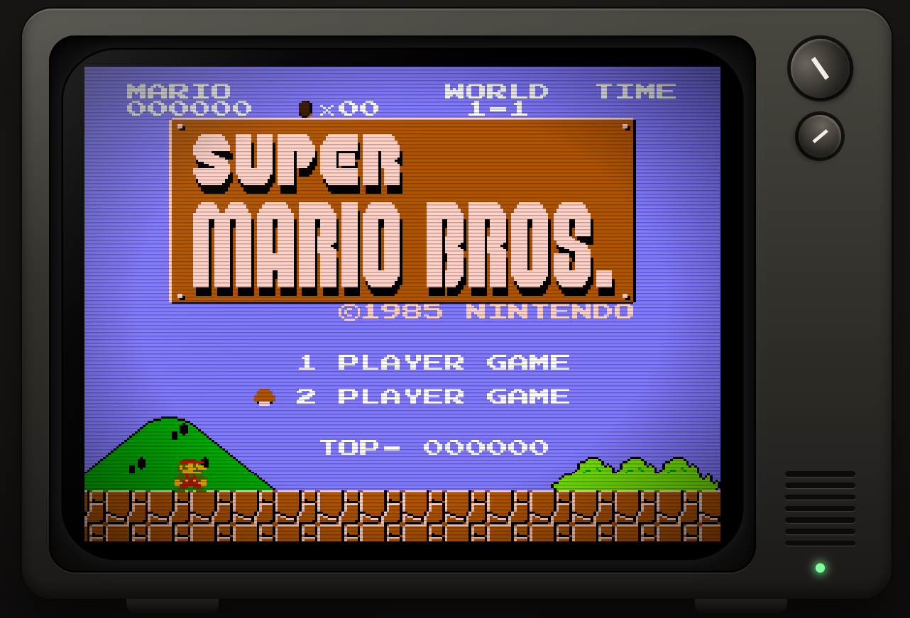
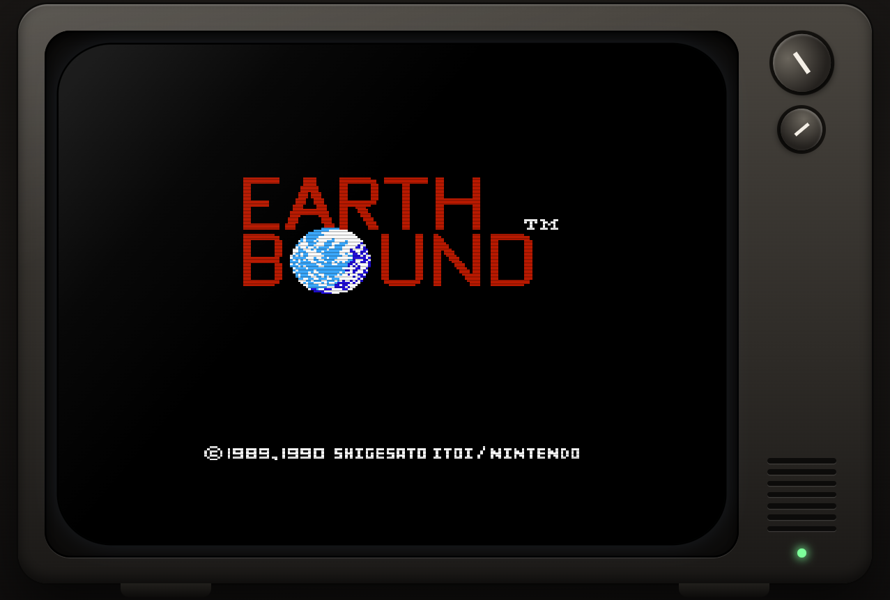
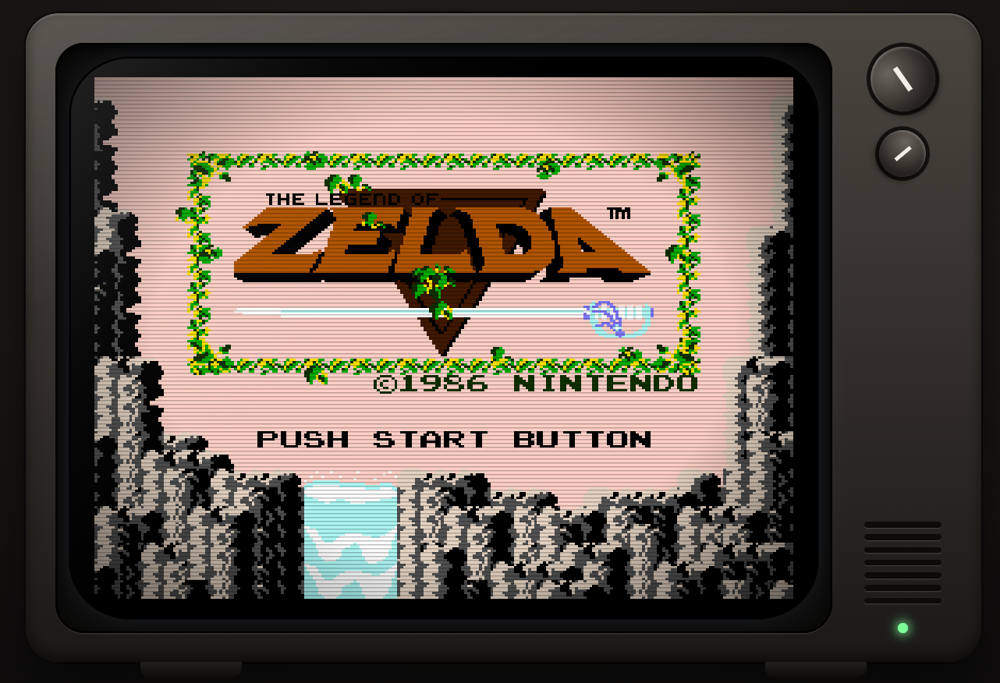

# NES Web

Emulador de NES para el navegador, hecho con React y Vite. La interfaz es un televisor CRT retro: la pantalla muestra estática con un letrero que dice **"Arrastre el archivo .ROM"**, y basta con soltar la ROM sobre la ventana para cargarla.

> Proyecto en construcción, se desarrolla por etapas.

## Estado actual

**Etapa 1 completada: interfaz y carga de ROM.**

- Televisor CRT con marco, perillas, altavoz y LED, hecho solo con CSS.
- Estática animada en un `<canvas>` de 256x240 (la resolución de la NES), con ruido, banda que sube y parpadeo. Respeta `prefers-reduced-motion`.
- Letrero pixelado con la fuente Press Start 2P. Cambia según el estado: arrastrando, cargando y error.
- Arrastrar y soltar en toda la ventana, o clic / Enter sobre la pantalla para abrir el selector de archivos.
- Lectura y validación de la cabecera iNES / NES 2.0: mapper, tamaño de PRG y CHR, espejo y batería. Detecta archivos que no son ROMs y ROMs incompletas.
- Al cargar una ROM válida, la pantalla mostraba sus datos en verde fosforito (en la etapa 2 esa pantalla dio paso al emulador y los datos pasaron a la barra inferior).
- Diseño adaptable a móvil.

**Etapa 2 completada: emulador con video y teclado.**

- Núcleo `jsnes` envuelto en la clase `Emulator`, que corre a ~60 fps y dibuja cada cuadro en un `<canvas>` de 256x240.
- Teclado: flechas o WASD para moverse, `X` = A, `Z` = B, `Enter` = Start, `Shift` = Select.
- Barra inferior con los datos de la ROM, la leyenda de controles y el botón "Expulsar ROM".
- Si el mapper no está soportado, se muestra el error en el letrero.

**Etapa 3 completada: sonido.**

- Audio de `jsnes` reproducido con un `AudioWorklet` y un búfer circular (`NesAudio`).
- Control de volumen y botón de silencio en la barra inferior, o tecla `M`. El ajuste se recuerda entre visitas.
- Aviso cuando el navegador bloquea el audio hasta que hay un clic o una tecla.
- Requiere `localhost` o `https` (el `AudioWorklet` no existe en páginas `http` normales); sin eso el juego corre en silencio.

## Hoja de ruta

- [x] **Etapa 1:** interfaz CRT, estática, letrero y carga de ROM
- [x] **Etapa 2:** núcleo del emulador ([jsnes](https://github.com/bfirsh/jsnes)), video en pantalla y control con teclado
- [x] **Etapa 3:** sonido con botón de silencio
- [ ] **Etapa 4:** soporte de gamepad (Gamepad API)
- [ ] **Etapa 5:** guardar y cargar estado

## Cómo correrlo

Requisitos: [Node.js](https://nodejs.org/) 18 o superior.

```bash
npm install
npm run dev
```

Abre la dirección que muestra la terminal (normalmente `http://localhost:5173`) y arrastra un archivo `.nes` a la pantalla.

Para generar la versión de producción:

```bash
npm run build
npm run preview
```

## Cómo funciona: la consola original y cómo se recrea

La NES (Nintendo Entertainment System) es un conjunto de chips especializados que trabajan a la vez: una CPU que ejecuta el juego, un chip de video, un chip de sonido, un cartucho con la memoria del juego, dos controles y un televisor que muestra la imagen. Un emulador reproduce ese comportamiento con software.

En este proyecto el **núcleo de emulación** (CPU, PPU, APU y los mappers de los cartuchos) lo aporta la librería [jsnes](https://github.com/bfirsh/jsnes). Lo que se construye aquí es el resto de la "consola": el cartucho, los controles, el reloj, la salida de video y sonido, y el televisor.

### Mapa de componentes

| Componente original | Qué hace en la consola real | Cómo se recrea aquí |
| --- | --- | --- |
| Cartucho | Guarda el código del juego (PRG), los gráficos (CHR) y, a veces, un chip "mapper" | El archivo `.nes`. `lib/rom.js` lee su cabecera. Arrastrarlo equivale a insertar el cartucho y "Expulsar ROM" a sacarlo |
| CPU (Ricoh 2A03) | Ejecuta las instrucciones del juego | `jsnes` |
| PPU (2C02) | Dibuja la imagen: fondos, sprites y paleta de colores | `jsnes` calcula cada cuadro; `Emulator.js` lo copia a un `<canvas>` |
| APU | Genera el sonido con cinco canales | `jsnes` genera las muestras; `NesAudio.js` y un `AudioWorklet` las reproducen |
| Controles | Envían el estado de 8 botones a la consola | `keymap.js` traduce el teclado a botones (el gamepad llegará en la etapa 4) |
| Reloj | Marca el ritmo de todos los chips | El bucle de `Emulator.js` avanza un cuadro cada 1/60,0988 s |
| Televisor CRT | Recibe la señal de video y la muestra en su tubo | `Tv.jsx` y `index.css`: marco, pantalla curva, líneas de barrido, brillo y parpadeo |
| Pantalla sin señal | Muestra "nieve" cuando no llega imagen | `StaticCanvas.jsx`: ruido animado en un `<canvas>` |
| Botón y LED de encendido | Indican si la consola está encendida | El LED de `Tv.jsx` pasa de rojo a verde al cargar una ROM |

### Flujo de una ROM

```
archivo .nes ──► rom.js (valida la cabecera) ──► Emulator.load() ──► jsnes.loadROM()

cada ~16,6 ms:  jsnes.frame()
                  ├─ onFrame ────────► ImageData ──► <canvas> ──► pantalla del televisor
                  └─ onAudioSample ──► NesAudio ──► AudioWorklet ──► volumen ──► altavoces
teclado ──► keymap.js ──► jsnes.buttonDown / buttonUp
```

### El cartucho y el formato iNES

Los archivos `.nes` usan el formato iNES: una cabecera de 16 bytes que empieza con los bytes `4E 45 53 1A` (las letras "NES" seguidas de un fin de archivo de MS-DOS), y a continuación los datos del juego. El byte 4 indica el tamaño de la PRG-ROM en bloques de 16 KB y el byte 5 el de la CHR-ROM en bloques de 8 KB (un 0 significa que la placa usa CHR-RAM). Los bytes 6 y 7 guardan el número de mapper, la disposición de los nametables (el "espejo"), si el cartucho tiene batería para guardar partidas y si incluye un "trainer" de 512 bytes. Si `byte 7 AND $0C` vale `$08`, el archivo es NES 2.0, una versión ampliada del formato.

El **mapper** es el circuito del cartucho que gestiona la memoria. Sin él, los juegos estarían limitados a unos 40 KB. Con él, el cartucho cambia dinámicamente qué bloque de su memoria ve la consola (bank switching), lo que permitió juegos más grandes. `rom.js` valida la cabecera y comprueba que el archivo no esté truncado; si `jsnes` no soporta el mapper de la ROM, el letrero lo avisa.

### CPU, PPU y el reloj

La CPU de la NES es un Ricoh 2A03 (RP2A03 en NTSC), basado en el MOS 6502 pero sin su modo decimal. Funciona a 1,789773 MHz, que resulta de dividir entre 12 el reloj maestro de 21,477272 MHz. La PPU trabaja al triple de velocidad que la CPU: dibuja 341 puntos por línea en 262 líneas, unos 29 780 ciclos de CPU por cuadro, lo que da unos 60,0988 cuadros por segundo. Por eso el bucle no usa 60 exactos: `Emulator.js` acumula el tiempo que pasa entre cuadros de pantalla y ejecuta un cuadro del emulador cada 1000 / 60,0988 ms. Si el navegador se atrasa recupera hasta 4 cuadros de una vez, y si la pestaña estuvo en segundo plano limita el salto para que el juego no se acelere.

La PPU produce una imagen de 256x240 píxeles con una paleta de 64 colores, hasta 64 sprites (8 por línea) y 4 paletas para fondos y 4 para sprites. `jsnes` entrega cada cuadro como una lista de colores y `Emulator.js` la escribe en un `ImageData` y la pinta en el `<canvas>` con `putImageData`. El canvas se escala con `image-rendering: pixelated` para conservar los píxeles nítidos.

### El sonido

La APU tiene cinco canales: dos ondas de pulso, una triangular, ruido y un canal DMC para muestras digitales, combinados con una mezcla no lineal. `jsnes` hace esa mezcla y entrega las muestras una a una. `NesAudio.js` las agrupa por cuadro (unas 734 por cuadro a 44 100 Hz) y las envía a un `AudioWorklet`, que las reproduce desde un búfer circular en el hilo de audio. El búfer espera unos 60 ms antes de empezar a sonar para evitar cortes y descarta muestras viejas si se atrasa. `jsnes` se configura con la misma frecuencia de muestreo que el navegador, y un `GainNode` aplica el volumen y el silencio. Los navegadores solo dejan sonar tras un clic o una tecla del usuario, por eso la interfaz muestra un aviso hasta ese momento.

### Los controles

La NES lee cada control mediante los registros `$4016` y `$4017`: los ocho botones se cargan a la vez en un registro de desplazamiento y la consola los lee de uno en uno, en este orden: A, B, Select, Start, Arriba, Abajo, Izquierda y Derecha. `jsnes` recibe los botones con `buttonDown` y `buttonUp`, por lo que `keymap.js` solo tiene que traducir las teclas a esos ocho botones. Se usa `event.code` para que la disposición del teclado no importe, y al perder el foco se sueltan todos los botones para que ninguno quede "pegado".

### El televisor

La PPU de la NES genera una señal de video compuesta pensada para un televisor CRT. Este proyecto no procesa esa señal: imita el aspecto del televisor con CSS. La pantalla tiene proporción 4:3 y esquinas curvas; encima se apilan unas líneas de barrido (`repeating-linear-gradient`), una viñeta oscura en los bordes y un reflejo del cristal, y una animación de parpadeo cambia el brillo. El marco, las perillas, el altavoz y el LED son elementos decorativos hechos con degradados y sombras.

## Estructura

```
src/
├── main.jsx                    punto de entrada
├── App.jsx                     estado general y flujo de carga
├── index.css                   estilos del televisor, letrero, pantalla y barra inferior
├── components/
│   ├── Tv.jsx                  marco del televisor CRT
│   ├── StaticCanvas.jsx        estática animada
│   ├── DropSign.jsx            letrero "Arrastre el archivo .ROM"
│   ├── NesScreen.jsx           canvas donde corre el juego y manejo del teclado
│   └── Hud.jsx                 barra inferior: datos de la ROM, sonido y controles
├── emulator/
│   ├── Emulator.js             envuelve jsnes: bucle a 60 fps, video y botones
│   ├── NesAudio.js             audio: muestras de jsnes hacia el AudioWorklet
│   ├── audioWorklet.js         procesador de audio con búfer circular
│   └── keymap.js               teclas -> botones de la NES
├── hooks/
│   ├── useFileDrop.js          arrastrar y soltar sobre la ventana
│   └── useAudioSettings.js     volumen y silencio guardados en el navegador
└── lib/
    └── rom.js                  lectura y validación de la cabecera iNES
```

## Visualizacion
### Mario Bros


### EarthBound


### The legend of zelda


## Basado en
- https://github.com/afska/nestation

### Tecnologías y créditos

- [jsnes](https://github.com/bfirsh/jsnes), emulador de NES en JavaScript de Ben Firshman, con licencia Apache-2.0. Aporta la CPU, la PPU, la APU y los mappers.
- [React](https://react.dev/) y [Vite](https://vite.dev/guide/) para la interfaz y las herramientas de desarrollo.
- [Press Start 2P](https://fonts.google.com/specimen/Press+Start+2P), fuente tipográfica de CodeMan38 (Cody Boisclair) con licencia SIL Open Font License.
- La [wiki de NESdev](https://www.nesdev.org/wiki/) como referencia técnica del hardware original.

## Bibliografía

Fuentes consultadas el 20 de septiembre de 2026.

**Hardware de la NES**

1. NESdev Wiki. *CPU*. https://www.nesdev.org/wiki/CPU
2. NESdev Wiki. *PPU*. https://www.nesdev.org/wiki/PPU
3. NESdev Wiki. *PPU frame timing*. https://www.nesdev.org/wiki/PPU_frame_timing
4. NESdev Wiki. *PPU OAM*. https://www.nesdev.org/wiki/PPU_OAM
5. NESdev Wiki. *PPU palettes*. https://www.nesdev.org/wiki/PPU_palettes
6. NESdev Wiki. *Cycle reference chart*. https://www.nesdev.org/wiki/Cycle_reference_chart
7. NESdev Wiki. *APU*. https://www.nesdev.org/wiki/APU
8. NESdev Wiki. *iNES*. https://www.nesdev.org/wiki/INES
9. NESdev Wiki. *Mapper*. https://www.nesdev.org/wiki/Mapper
10. NESdev Wiki. *Standard controller*. https://www.nesdev.org/wiki/Standard_controller

**Software y tecnologías web**

11. Firshman, B. *jsnes: A JavaScript NES emulator* (repositorio de GitHub). https://github.com/bfirsh/jsnes
12. MDN Web Docs. *AudioWorklet*. https://developer.mozilla.org/en-US/docs/Web/API/AudioWorklet
13. MDN Web Docs. *Web Audio API best practices* (política de reproducción automática). https://developer.mozilla.org/en-US/docs/Web/API/Web_Audio_API/Best_practices
14. MDN Web Docs. *HTML Drag and Drop API*. https://developer.mozilla.org/en-US/docs/Web/API/HTML_Drag_and_Drop_API
15. MDN Web Docs. *CanvasRenderingContext2D: putImageData()*. https://developer.mozilla.org/en-US/docs/Web/API/CanvasRenderingContext2D/putImageData
16. MDN Web Docs. *Gamepad API* (para la etapa 4). https://developer.mozilla.org/en-US/docs/Web/API/Gamepad_API
17. React. *Documentación oficial*. https://react.dev/
18. Vite. *Getting Started*. https://vite.dev/guide/
19. Google Fonts. *Press Start 2P*. https://fonts.google.com/specimen/Press+Start+2P

## Notas

- Las ROMs no se incluyen en el repositorio. Usa solo juegos que poseas legalmente. Por eso el `.gitignore` excluye los archivos `.nes` y `.rom`.
- Este proyecto es independiente y no tiene relación con Nintendo. "Nintendo Entertainment System" y "NES" son marcas de sus respectivos propietarios.
- La fuente Press Start 2P se carga desde Google Fonts. Sin conexión, la interfaz usa una fuente monoespaciada.
- La fuente pixelada no tiene tildes ni eñes, por eso los textos de la pantalla van sin acentos.